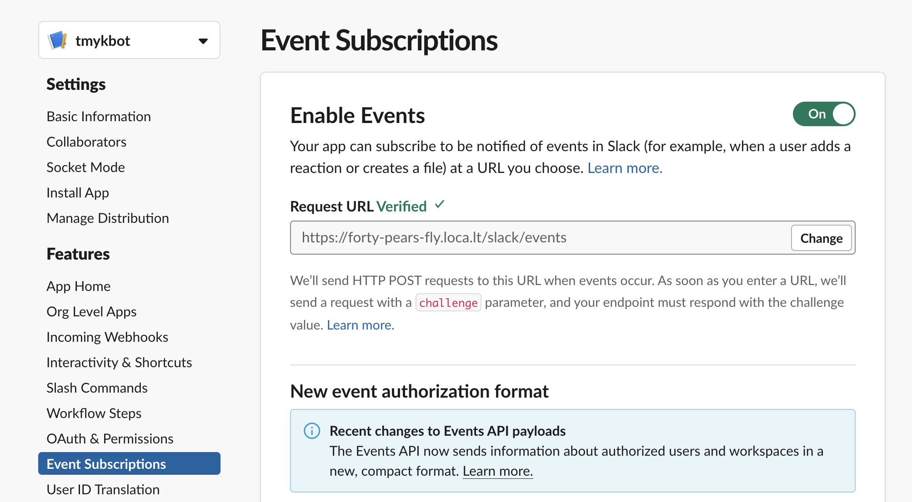

# Slack Bot

## Development

### Set up development env

1. Create venv with Python

```
python -m venv env
source env/bin/activate
```

2. Install packages

```
pip install -r requirements.txt
```

3. Start app

```
python main.py
```

4. Start tunneling

```
make tunnel
```

5. Change "Request URL" for Event Subscriptions on Slack API console

```
Event Subscriptions -> Enable Events ->  Request URL
```



## Slack App Manifest

```
display_information:
  name: tmykbot
features:
  bot_user:
    display_name: tmykbot
    always_online: false
oauth_config:
  redirect_urls:
    - https://forty-pears-fly.loca.lt/slack/events
  scopes:
    bot:
      - app_mentions:read
      - chat:write
      - chat:write.public
      - channels:history
      - groups:history
settings:
  event_subscriptions:
    request_url: https://forty-pears-fly.loca.lt/slack/events
    bot_events:
      - message.channels
      - message.groups
  org_deploy_enabled: false
  socket_mode_enabled: false
  token_rotation_enabled: false
```

### Deploy a bot to Lambda

[Bolt for Python + AWS Lambda & S3 で運用するほぼゼロコスト Slack アプリ #Slack - Qiita](https://qiita.com/seratch/items/12b39d636daf8b1e5fbf#aws-lambda-%E7%92%B0%E5%A2%83%E3%81%AB%E3%83%87%E3%83%97%E3%83%AD%E3%82%A4%E3%81%97%E3%81%A6%E5%8B%95%E4%BD%9C%E3%82%92%E7%A2%BA%E8%AA%8D%E3%81%99%E3%82%8B)

Install serverless framework

```
npm install -g serverless
```

Install plugins for serverless framework

```
serverless plugin install -n serverless-python-requirements
```

Deploy bot app

```
serverless deploy
```